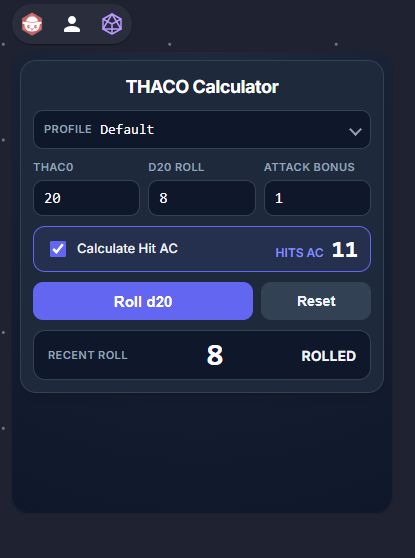

# THACO

aka **[T]** o **[H]** it **[A]** rmor **[C]** lass **[Z]** ero

An [Owlbear.Rodeo](https://www.owlbear.rodeo/) extension for calculating your THAC0.



## Features

- Enter your THAC0, the target's Armor Class and your attack bonus to get the d20 roll you need (clamped to 1-20).
- Roll a d20 and see whether it hits or misses. A natural 20 always hits and a natural 1 always misses. Results are shown as an Owlbear notification.
- "Calculate hit AC instead" mode: enter (or roll) a d20 and see which Armor Class it hits.
- Your inputs are remembered between sessions.

## Install in Owlbear Rodeo

1. In Owlbear Rodeo, open your profile menu and choose **Add Custom Extension**.
2. Paste the manifest URL: `https://jessescott.github.io/thaco/manifest.json`

## Development

The app lives in `THACO/` and is built with [Vite](https://vite.dev/) and the [Owlbear SDK](https://github.com/owlbear-rodeo/sdk).

```sh
cd THACO
npm install
npm run dev        # dev server on http://localhost:5173
npm test           # unit tests (node:test)
npm run test:ui    # Playwright UI tests (run `npx playwright install chromium` once)
npm run build      # production build in dist/
```

Outside Owlbear the page works standalone; Owlbear-specific calls (notifications) are skipped.

To try a local build inside Owlbear, run `npm run dev` and add `http://localhost:5173/manifest.json` as a custom extension.

## CI and deployment

- `Build and Test` installs dependencies, builds, and runs the unit tests and UI tests on every push and PR to `main`. Node comes from `.node-version`.
- On a push to `main` (or a manual run), once those pass, its `deploy` job publishes `THACO/dist` to GitHub Pages. Pages must be set to the **GitHub Actions** source in the repository settings.
- Dependabot opens weekly PRs for npm packages and GitHub Actions.

## License

See [LICENSE](LICENSE).
